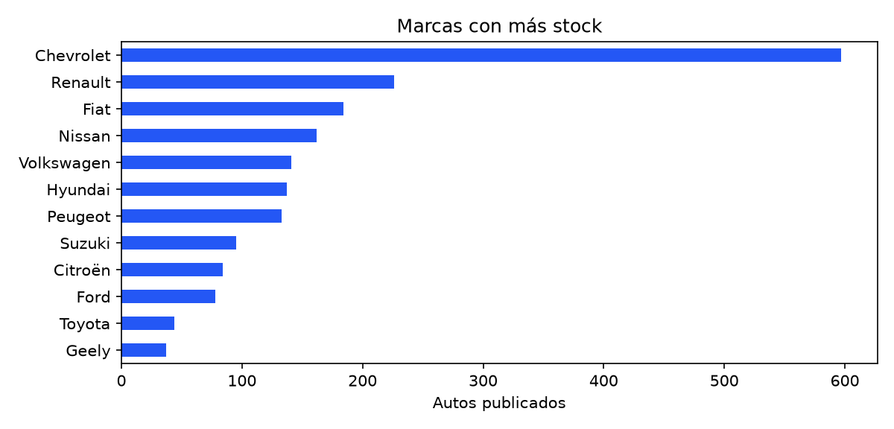
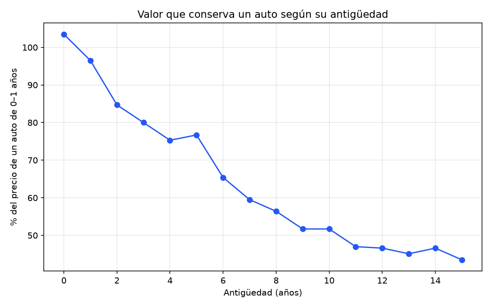
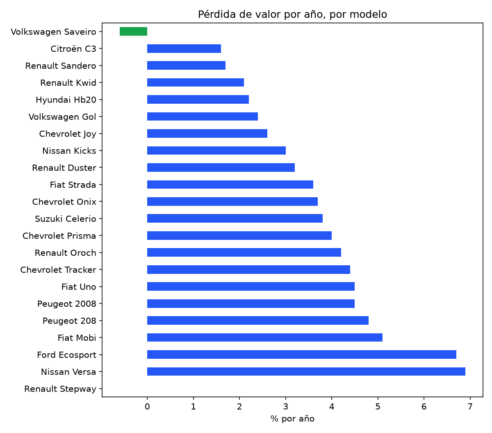
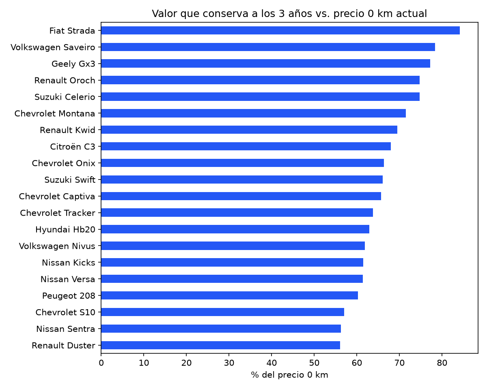
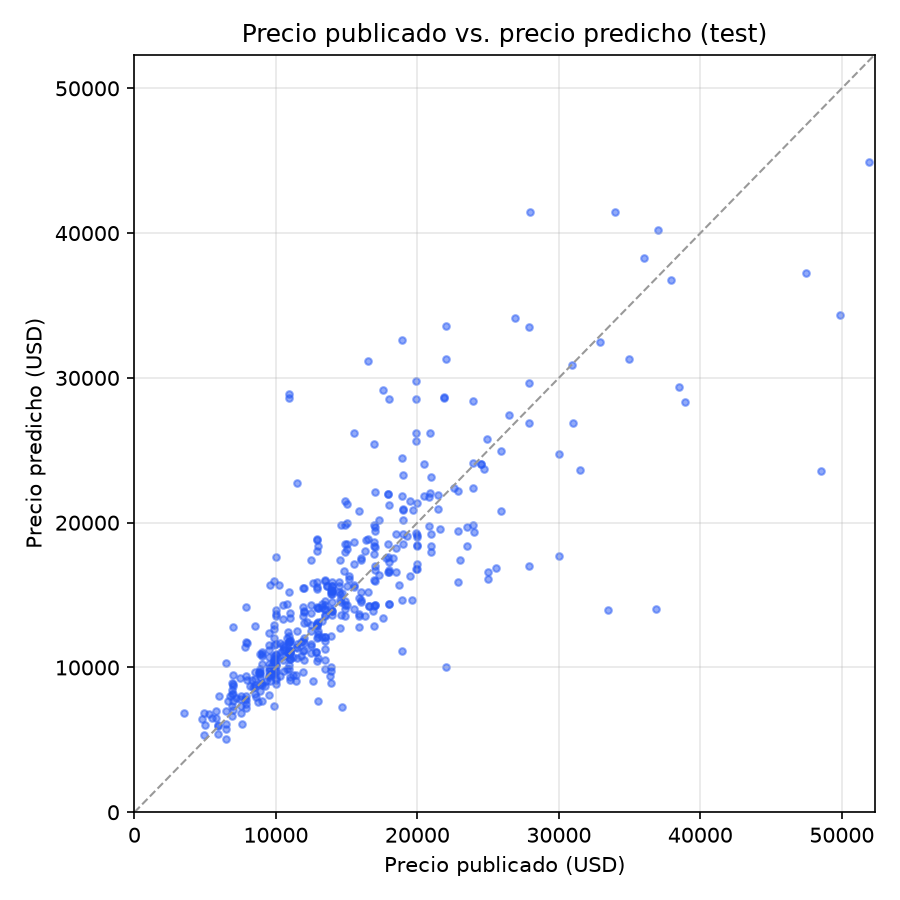
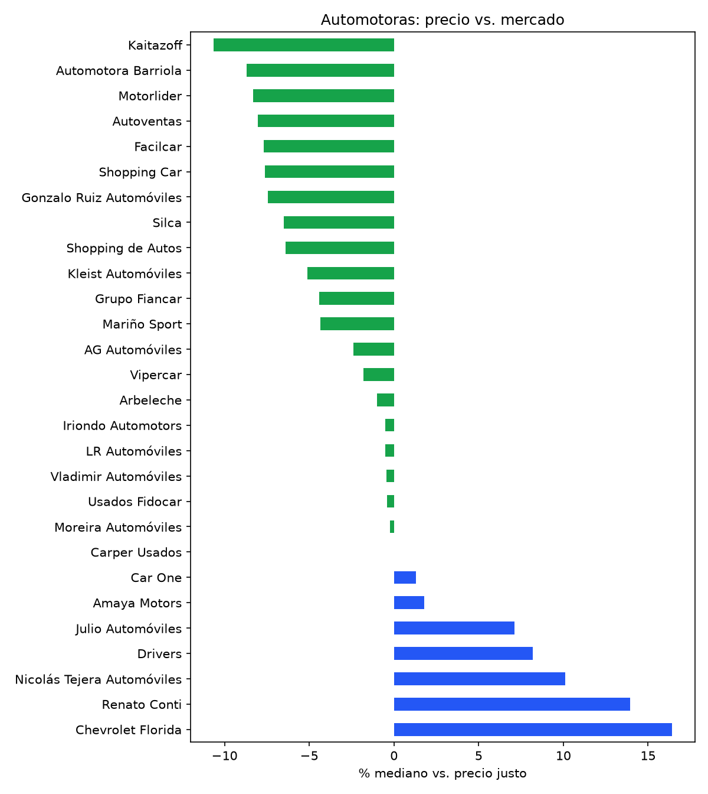

# Vidriera Insights — 09/10/2026

Análisis de **2,303 autos usados activos** (USD) de **27 automotoras** uruguayas,
a partir de los datos públicos de [Vidriera](https://vidriera-uy.vercel.app).

## 1. Marcas con más stock

| brand      |   listings |   median_price |   median_year |   median_km |
|:-----------|-----------:|---------------:|--------------:|------------:|
| Chevrolet  |        597 |          13490 |          2020 |       84424 |
| Renault    |        226 |          10990 |          2019 |       96049 |
| Fiat       |        184 |          10650 |          2018 |      106000 |
| Nissan     |        162 |          14700 |          2019 |       87340 |
| Volkswagen |        141 |          13900 |          2018 |       89617 |
| Hyundai    |        137 |          14990 |          2021 |       83705 |
| Peugeot    |        133 |          11890 |          2018 |      100792 |
| Suzuki     |         95 |          10990 |          2019 |       89000 |
| Citroën    |         84 |          11850 |          2019 |      106262 |
| Ford       |         78 |          12895 |          2017 |      112030 |
| Toyota     |         44 |          20245 |          2019 |      160000 |
| Geely      |         37 |          11890 |          2020 |       91048 |

## 2. Depreciación

### Curva general
Mediana del precio publicado según la antigüedad, como % de la mediana de los autos de **0–1 año que hoy
están en el stock usado** (no del precio de lista 0 km). Mezcla modelos distintos: los autos nuevos del
stock son más SUVs y marcas chinas que los viejos, así que la curva **exagera** la caída. Para comparar
autos de verdad, ver las tablas por modelo.

|   age |   listings |   median_price |   value_kept_pct |
|------:|-----------:|---------------:|-----------------:|
|     0 |         34 |          20740 |             99.4 |
|     1 |         99 |          20990 |            100.6 |
|     2 |        159 |          17590 |             84.3 |
|     3 |        203 |          16990 |             81.4 |
|     4 |        210 |          15990 |             76.6 |
|     5 |        140 |          16440 |             78.8 |
|     6 |        158 |          13640 |             65.4 |
|     7 |        159 |          12890 |             61.8 |
|     8 |        222 |          11990 |             57.5 |
|     9 |        145 |          10900 |             52.2 |
|    10 |        105 |          10900 |             52.2 |
|    11 |        121 |           9990 |             47.9 |
|    12 |        119 |           9890 |             47.4 |
|    13 |         85 |           9990 |             47.9 |
|    14 |         75 |           9900 |             47.4 |
|    15 |         63 |           8990 |             43.1 |

### Por modelo, separando edad y kilometraje
Dos regresiones log-lineales por modelo (autos de hasta 12 años, modelos con ≥20 publicaciones):

- `total_yearly_loss_pct`: `log(precio) ~ antigüedad`. La pérdida anual que ve un comprador, que mezcla
  envejecer y sumar kilómetros.
- `yearly_loss_pct`: `log(precio) ~ antigüedad + km`. La pérdida **solo por edad**, a igual kilometraje.
- `loss_per_10k_km_pct`: en la misma regresión, la pérdida por cada **10.000 km** extra a igual edad.

Un valor bajo significa que el modelo **retiene mejor su valor**. Muestras chicas dan coeficientes ruidosos
(un valor negativo en km indica justamente eso).

| brand      | model    |   listings |   median_price |   yearly_loss_pct |   loss_per_10k_km_pct |   total_yearly_loss_pct |
|:-----------|:---------|-----------:|---------------:|------------------:|----------------------:|------------------------:|
| Citroën    | C3       |         28 |          11900 |               1.6 |                   1.7 |                     2.6 |
| Renault    | Sandero  |         24 |           9700 |               1.7 |                   2.2 |                     3.1 |
| Hyundai    | Hb20     |         46 |          14990 |               1.7 |                   2.1 |                     3.5 |
| Volkswagen | Gol      |         27 |          11900 |               2.1 |                   0.9 |                     2.4 |
| Renault    | Kwid     |         42 |           9895 |               2.3 |                   1   |                     2.7 |
| Chevrolet  | Joy      |         63 |          12290 |               2.6 |                   2.2 |                     4.2 |
| Renault    | Duster   |         26 |          12890 |               3.5 |                   1.3 |                     4.1 |
| Fiat       | Strada   |         45 |          15690 |               3.6 |                   1.4 |                     5.2 |
| Suzuki     | Celerio  |         27 |          11490 |               3.8 |                   1.7 |                     4.8 |
| Chevrolet  | Onix     |        209 |          13990 |               3.8 |                   1.7 |                     5.3 |
| Chevrolet  | Prisma   |         38 |          10990 |               4   |                   1.1 |                     3.7 |
| Nissan     | Kicks    |         35 |          18990 |               4.3 |                   1.9 |                     6   |
| Chevrolet  | Tracker  |         62 |          18390 |               4.3 |                   2.6 |                     6.5 |
| Peugeot    | 2008     |         23 |          14990 |               4.4 |                   1.8 |                     6.4 |
| Peugeot    | 208      |         53 |          13500 |               4.6 |                   1.1 |                     5.2 |
| Renault    | Oroch    |         39 |          15490 |               4.6 |                   1.6 |                     6.1 |
| Fiat       | Uno      |         35 |           8900 |               5.5 |                   0.5 |                     4.3 |
| Ford       | Ecosport |         34 |          13245 |               6.8 |                  -0.7 |                     4.5 |
| Nissan     | Versa    |         30 |          16245 |               7.3 |                   0.5 |                     7.2 |
| Fiat       | Mobi     |         20 |          10150 |             nan   |                 nan   |                     5.4 |

### Desde 0 km
Valor que conserva un usado frente al **precio de lista 0 km actual** del mismo modelo, con
`log(precio usado / precio 0 km) ~ antigüedad` sobre autos de hasta 6 años (misma generación).
El precio 0 km es la mediana de las versiones del modelo en la
[lista de precios de Autoblog Uruguay](https://www.autoblog.com.uy/p/precios-0km.html)
(1051 versiones, actualizada al 2026-10-12; precios en USD con IVA). Solo cuentan las versiones
**comparables**: misma motorización que los usados (un Captiva naftero no se compara con el Captiva EV) y sin
sub-modelos que casi no aparecen entre los usados (Swift Sport). Se descartan los modelos con menos de 10 usados
recientes o con una curva sin sentido (que *sube* con la edad).

Como no se sabe la versión de cada usado, hay dos lecturas: `kept_3y_pct` contra la **versión mediana** y
`kept_3y_vs_base_pct` contra la **más barata**. El valor real está entre las dos.

Ojo: es el precio de lista **de hoy**, no el que pagó el primer dueño, y no incluye las bonificaciones que suelen
dar las concesionarias (lo que exagera un poco la pérdida). Es una aproximación razonable a "cuánto pierde un auto
desde nuevo", no un valor exacto.

Versiones 0 km usadas para cada modelo

| brand      | model   | versions_used                                                                                                                                                                                                                                                                                                   |
|:-----------|:--------|:----------------------------------------------------------------------------------------------------------------------------------------------------------------------------------------------------------------------------------------------------------------------------------------------------------------|
| Fiat       | Strada  | Strada Endurance Cabina Plus 1.3 M/T (16,490) · Strada Freedom Cabina Doble 1.3 M/T (17,990) · Strada Volcano Cabina Doble 1.3 CVT (21,290) · Strada Ultra Cabina Doble Turbo 200 1.0 CVT (22,990)                                                                                                              |
| Volkswagen | Saveiro | Saveiro Cabina Simple 1.6 (17,590) · Saveiro Cabina Doble 1.6 (17,990) · Saveiro Cabina Doble Extreme 1.6 (20,690) · Saveiro Cabina Doble Extreme Plus 1.6 (21,990)                                                                                                                                             |
| Geely      | Gx3     | GX3 Pro 1.5 GB M/T (16,990) · GX3 Pro 1.5 GC M/T (17,990) · GX3 Pro 1.5 GF CVT (20,990)                                                                                                                                                                                                                         |
| Renault    | Oroch   | Oroch Cargo 1.6 SCe M/T 2WD (19,990) · Oroch Cargo Pro 1.6 SCe M/T 2WD (20,990) · Oroch Zen 1.6 SCe M/T 2WD (21,900) · Oroch Intens Outsider 1.6 SCe M/T 2WD (24,490) · Oroch Intens 1.3 TCe CVT 2WD (25,990) · Oroch Intens Outsider 1.3 TCe CVT 2WD (27,490) · Oroch Intens Outsider 1.3 TCe M/T 4WD (28,990) |
| Suzuki     | Celerio | Celerio 1.0 GL M/T (15,990) · Celerio 1.0 GL AMT (17,290)                                                                                                                                                                                                                                                       |
| Chevrolet  | Montana | Montana LT 1.2 Turbo A/T (21,990) · Montana LTZ 1.2 Turbo A/T (24,990) · Montana Premier 1.2 Turbo A/T (26,990) · Montana RS 1.2 Turbo A/T (27,490)                                                                                                                                                             |
| Renault    | Kwid    | Kwid Evolution 1.0 SCe (14,500) · Kwid Techno 1.0 SCe (15,200) · Kwid Bitono 1.0 SCe (15,600) · Kwid Outsider 1.0 SCe (15,900)                                                                                                                                                                                  |
| Citroën    | C3      | C3 1.0 M/T Live (15,990) · C3 1.0 M/T Live Pack (16,990) · C3 1.0 M/T Feel (17,990) · C3 1.6 16v Feel Pack AT6 (20,990) · C3 You! 1.0 Turbo 200 CVT (22,990)                                                                                                                                                    |
| Chevrolet  | Onix    | Onix LT 1.0 (18,990) · Onix LTZ 1.0 Turbo M/T (22,490) · Onix Premier 1.0 Turbo A/T (24,790) · Onix RS 1.0 Turbo A/T (24,990) · Onix Plus LT 1.0 (19,990) · Onix Plus LTZ 1.0 Turbo M/T (23,490) · Onix Plus Premier 1.0 Turbo A/T (25,990)                                                                     |
| Suzuki     | Swift   | Swift Hybrid 1.2 GLX M/T (22,990) · Swift Hybrid 1.2 GLX CVT (24,990)                                                                                                                                                                                                                                           |
| Chevrolet  | Captiva | Captiva XL LTZ 1.5 T FWD CVT (34,990) · Captiva XL Premier 1.5 T FWD CVT (36,990)                                                                                                                                                                                                                               |
| Chevrolet  | Tracker | Tracker LT 1.2 Turbo A/T (27,990) · Tracker LTZ 1.2 Turbo A/T (31,990) · Tracker Premier 1.2 Turbo A/T (33,790) · Tracker RS 1.2 Turbo A/T (33,990)                                                                                                                                                             |
| Hyundai    | Hb20    | HB20 1.0 Comfort M/T (16,990) · HB20 1.0 Premium M/T (19,990) · HB20 1.6 Premium M/T (22,900) · HB20 1.6 Premium A/T (24,990) · HB20 1.6 Unique M/T (25,990) · HB20 1.6 Unique A/T (27,990)                                                                                                                     |
| Volkswagen | Nivus   | Nivus Comfortline 170 TSI 1.0 M/T (25,690) · Nivus Comfortline 200 TSI 1.0 A/T (28,990) · Nivus Highline 200 TSI 1.0 A/T (32,990) · Nivus Outfit 200 TSI 1.0 A/T (33,990) · Nivus GTS 250 TSI 1.4 A/T (35,990)                                                                                                  |
| Nissan     | Kicks   | Kicks 1.0T Sense EDC (31,990) · Kicks 1.0T Advance EDC (33,990) · Kicks 1.0T Exclusive EDC (36,490)                                                                                                                                                                                                             |
| Nissan     | Versa   | Versa Drive Sense 1.6 M/T (25,990) · Versa 1.6 Sense M/T (27,990) · Versa 1.6 Sense CVT (28,990) · Versa 1.6 Advance CVT (29,990) · Versa 1.6 Exclusive CVT (32,990)                                                                                                                                            |
| Peugeot    | 208     | 208 Active 1.0 BVM5 (17,990) · 208 Style 1.0 BVM5 (19,990) · 208 Allure 1.6 VTi BVM5 (24,990) · 208 Allure 1.0 Turbo 200 CVT (25,990) · 208 GT 1.0 Turbo 200 CVT (28,490)                                                                                                                                       |
| Chevrolet  | S10     | S10 WT 2.8 CTDI 4x2 M/T (47,568) · S10 WT 2.8 CTDI 4x4 M/T (51,990) · S10 WT 2.8 CTDI 4x4 AT8 (55,990) · S10 Z71 2.8 CTDI 4x4 AT8 (59,990) · S10 LTZ 2.8 CTDI 4x4 AT8 (65,990) · S10 High Country 2.8 CTDI 4x4 AT8 (67,990)                                                                                     |
| Nissan     | Sentra  | Sentra 2.0 Advance CVT (39,990) · Sentra 2.0 SR Platinum CVT (42,990)                                                                                                                                                                                                                                           |
| Renault    | Duster  | Duster Intens Plus 1.6 SCe M/T (24,500) · Duster Intens Plus 1.6 SCe CVT (24,990) · Duster Iconic 1.6 SCe CVT (30,800) · Duster Iconic Outsider 1.3 TCe CVT (31,200)                                                                                                                                            |

| brand      | model   |   new_price |   base_price |   versions |   used_listings |   median_used_age |   kept_1y_pct |   kept_3y_pct |   kept_5y_pct |   kept_3y_vs_base_pct |
|:-----------|:--------|------------:|-------------:|-----------:|----------------:|------------------:|--------------:|--------------:|--------------:|----------------------:|
| Fiat       | Strada  |       19640 |        16490 |          4 |              30 |               3.5 |          93.3 |          84.2 |          76.1 |                 100   |
| Volkswagen | Saveiro |       19340 |        17590 |          4 |              12 |               3   |          82.2 |          78.4 |          74.9 |                  86.2 |
| Geely      | Gx3     |       17990 |        16990 |          3 |              12 |               3.5 |          84.1 |          77.2 |          70.9 |                  81.7 |
| Renault    | Oroch   |       24490 |        19990 |          7 |              29 |               4   |          92.3 |          74.7 |          60.4 |                  91.5 |
| Suzuki     | Celerio |       16640 |        15990 |          2 |              17 |               5   |          80.2 |          74.7 |          69.6 |                  77.7 |
| Chevrolet  | Montana |       25990 |        21990 |          4 |              22 |               2   |          83.4 |          71.5 |          61.3 |                  84.5 |
| Renault    | Kwid    |       15400 |        14500 |          4 |              30 |               5   |          73.8 |          69.5 |          65.4 |                  73.8 |
| Citroën    | C3      |       17990 |        15990 |          5 |              15 |               2   |          78.5 |          68   |          58.9 |                  76.5 |
| Chevrolet  | Onix    |       23490 |        18990 |          7 |             153 |               3   |          70.6 |          66.4 |          62.5 |                  82.1 |
| Suzuki     | Swift   |       23990 |        22990 |          2 |              11 |               3   |          68.8 |          66.1 |          63.6 |                  69   |
| Chevrolet  | Captiva |       35990 |        34990 |          2 |              12 |               4   |          78.1 |          65.7 |          55.2 |                  67.6 |
| Chevrolet  | Tracker |       32890 |        27990 |          4 |              45 |               5   |          70.7 |          63.8 |          57.6 |                  75   |
| Hyundai    | Hb20    |       23945 |        16990 |          6 |              43 |               3   |          65.6 |          62.9 |          60.3 |                  88.6 |
| Volkswagen | Nivus   |       32990 |        25690 |          5 |              12 |               5   |          65.8 |          61.9 |          58.2 |                  79.5 |
| Nissan     | Kicks   |       33990 |        31990 |          3 |              25 |               3   |          69.3 |          61.5 |          54.5 |                  65.3 |
| Nissan     | Versa   |       28990 |        25990 |          5 |              21 |               3   |          71.1 |          61.4 |          53   |                  68.5 |
| Peugeot    | 208     |       24990 |        17990 |          5 |              31 |               3   |          72.5 |          60.3 |          50.2 |                  83.8 |
| Chevrolet  | S10     |       57990 |        47568 |          6 |              11 |               2   |          66.6 |          57   |          48.9 |                  69.5 |
| Nissan     | Sentra  |       41490 |        39990 |          2 |              14 |               4   |          69.2 |          56.3 |          45.8 |                  58.4 |
| Renault    | Duster  |       27895 |        24500 |          4 |              11 |               4   |          62.8 |          56.1 |          50   |                  63.9 |

## 3. Kilometraje
A igual marca, modelo y año, cada **10.000 km extra** cambian el precio en **USD -193**.

## 4. Combustible y caja
El combustible se completa desde el título cuando el aviso no lo indica (por ejemplo "EV", "Híbrido",
"Seagull"), porque cerca de un cuarto de los avisos no lo cargan.

| fuel      |   listings |   median_price |   median_age |
|:----------|-----------:|---------------:|-------------:|
| Híbrido   |         33 |          34900 |            2 |
| Diésel    |         78 |          28745 |            7 |
| Eléctrico |         19 |          21990 |            1 |
| Nafta     |       1569 |          12990 |            7 |

| transmission   |   listings |   median_price |   median_age |
|:---------------|-----------:|---------------:|-------------:|
| Automática     |        383 |          18490 |            5 |
| Manual         |        740 |          10990 |            8 |

### Eléctricos e híbridos
| fuel      |   listings |   share_pct |   median_price |   median_year | top_brands                                              |
|:----------|-----------:|------------:|---------------:|--------------:|:--------------------------------------------------------|
| Eléctrico |         19 |        0.83 |          21990 |          2025 | Byd (6), Chevrolet (3), Bmw (2), Dongfeng (2)           |
| Híbrido   |         33 |        1.43 |          34900 |          2024 | Hyundai (11), Toyota (7), Mercedes-Benz (3), Suzuki (3) |

Los eléctricos usados son casi todos de **2024–2026**: el mercado de eléctricos de segunda mano en Uruguay
recién empieza. Con tan pocos autos no tiene sentido estimar su depreciación todavía; la sección 8 sigue
cómo crece su participación semana a semana.

| brand     | model    |   year |   mileage_km |   price | source_name         |
|:----------|:---------|-------:|-------------:|--------:|:--------------------|
| Dongfeng  | Nano     |   2024 |        57273 |   10900 | Arbeleche           |
| Changan   | E-Star   |   2024 |            1 |   12490 | Car One             |
| Byd       | Seagull  |   2025 |         6300 |   16500 | Amaya Motors        |
| Geely     | Geometry |   2026 |        29000 |   17990 | Moreira Automóviles |
| Byd       | Seagull  |   2024 |        95000 |   17990 | Amaya Motors        |
| Byd       | Seagull  |   2025 |        22000 |   18990 | Mariño Sport        |
| Byd       | E2       |   2021 |        62400 |   18990 | Vipercar            |
| Chevrolet | Spark    |   2026 |        23000 |   20990 | Oliva Automotores   |
| Peugeot   | 208      |   2025 |        19927 |   20990 | Car One             |
| Jmc       | Jmev     |   2025 |           21 |   21990 | Car One             |
| Dongfeng  | Mage     |   2026 |          nan |   24890 | Usados Fidocar      |
| Byd       | Yuan     |   2026 |        23080 |   26490 | López Motors        |
| Byd       | Yuan     |   2026 |        16000 |   27490 | Shopping Car        |
| Omoda     | E5       |   2025 |         3000 |   31200 | Moreira Automóviles |
| Volvo     | C40      |   2022 |        35500 |   52990 | Amaya Motors        |
| Chevrolet | Equinox  |   2025 |        10617 |   58590 | Silca               |
| Chevrolet | Blazer   |   2025 |         7301 |   65990 | Silca               |
| Bmw       | Ix2      |   2025 |        37000 |   78900 | Grupo Fiancar       |
| Bmw       | I4       |   2024 |         4941 |   89900 | Arbeleche           |

## 5. Modelo de precio (machine learning)
Gradient boosting (`HistGradientBoostingRegressor`) sobre marca, modelo, combustible, caja, carrocería,
antigüedad y kilometraje, con objetivo `log(precio)`. Validación cruzada de 5 particiones:

| Métrica | Valor |
|---|---|
| Error medio (todos los autos) | **15.9%** (USD 2,648) |
| Error en autos con comparables — modelo | **10.6%** |
| Error en autos con comparables — precio justo de Vidriera | 10.6% |
| Autos que el método de comparables puede tasar | 56% |
| Error del modelo en autos **sin** comparables | 23.9% |

El modelo **iguala** al método de comparables donde éste funciona y además **tasa el 100% del stock**,
incluidos los modelos raros que no tienen suficientes autos parecidos.

**Qué pesa más en el precio** (caída del R² al desordenar cada variable):

|              |   importancia_pct |
|:-------------|------------------:|
| age          |              42.1 |
| brand        |              21.9 |
| model        |              16.2 |
| fuel         |               9.1 |
| mileage_km   |               6   |
| transmission |               3.5 |
| body_type    |               1.2 |

**Candidatos a revisar**: autos del set de test publicados más por debajo de lo que espera el modelo
(una señal para mirar de cerca, no una garantía: el aviso puede tener detalles que los datos no capturan).

| brand      | model    |   year |   mileage_km |   price |   predicted |   discount_pct |
|:-----------|:---------|-------:|-------------:|--------:|------------:|---------------:|
| Volkswagen | Polo     |   2025 |        20407 |   16490 |       31015 |           46.8 |
| Volkswagen | Polo     |   2022 |       127380 |   15500 |       26517 |           41.5 |
| Renault    | Oroch    |   2020 |       167742 |    9990 |       16176 |           38.2 |
| Chery      | Tiggo 2  |   2023 |        10657 |   14900 |       23046 |           35.3 |
| Toyota     | Hilux    |   2014 |       255593 |   16900 |       25650 |           34.1 |
| Nissan     | Frontier |   2024 |        79479 |   27990 |       42116 |           33.5 |
| Peugeot    | 208      |   2020 |       184467 |   10200 |       14778 |           31   |
| Jeep       | Renegade |   2021 |       123000 |   14990 |       21646 |           30.7 |
| Hyundai    | H1       |   2010 |       350000 |    7990 |       11499 |           30.5 |
| Peugeot    | 2008     |   2019 |        49252 |   12900 |       18338 |           29.7 |

## 6. Cómo pone precio cada automotora
Negativo = más barata que autos comparables.

| source_name                |   listings |   median_vs_fair_pct |   share_above_fair |
|:---------------------------|-----------:|---------------------:|-------------------:|
| Kaitazoff                  |         12 |               -10.95 |               25   |
| Autoventas                 |         10 |                -8.9  |               20   |
| Shopping de Autos          |         93 |                -7.4  |                9.7 |
| Silca                      |        109 |                -6.8  |               14.7 |
| Gonzalo Ruiz Automóviles   |         16 |                -6.45 |               12.5 |
| Facilcar                   |         12 |                -5.55 |               25   |
| Grupo Fiancar              |         61 |                -5.4  |               18   |
| Mariño Sport               |         23 |                -4.7  |               17.4 |
| Shopping Car               |         15 |                -3.2  |               13.3 |
| Vipercar                   |        108 |                -2.1  |               22.2 |
| Arbeleche                  |         12 |                -1.7  |               41.7 |
| Moreira Automóviles        |         14 |                -1.1  |               21.4 |
| Usados Fidocar             |         64 |                -0.95 |               28.1 |
| Car One                    |        138 |                 0    |               34.8 |
| Carper Usados              |        292 |                 0    |               30.1 |
| Kleist Automóviles         |         11 |                 0    |               36.4 |
| Amaya Motors               |         26 |                 4.3  |               50   |
| Drivers                    |         13 |                 5.9  |               53.8 |
| Julio Automóviles          |         67 |                 6.9  |               55.2 |
| Nicolás Tejera Automóviles |        117 |                10.5  |               66.7 |
| Chevrolet Florida          |         31 |                15.9  |               77.4 |

## 7. ¿Los autos caros tardan más en venderse?
| bucket    |   listings |   median_days |   share_with_price_cut |
|:----------|-----------:|--------------:|-----------------------:|
| <-10%     |        262 |             2 |                    1.1 |
| -10 a -2% |        319 |             2 |                    2.8 |
| ±2%       |        183 |             2 |                    0.5 |
| +2 a +10% |        245 |             2 |                    2.9 |
| >+10%     |        271 |             2 |                    0.4 |

> Vidriera registra datos desde el 07/10/2026: esta tabla gana sentido
> a medida que se acumulan semanas de historia (días publicados y rebajas de precio).

## 8. Evolución del mercado
Stock, precio mediano y % de eléctricos e híbridos en cada foto semanal.

_Se necesita más de una corrida con `--refresh` para ver la evolución._
